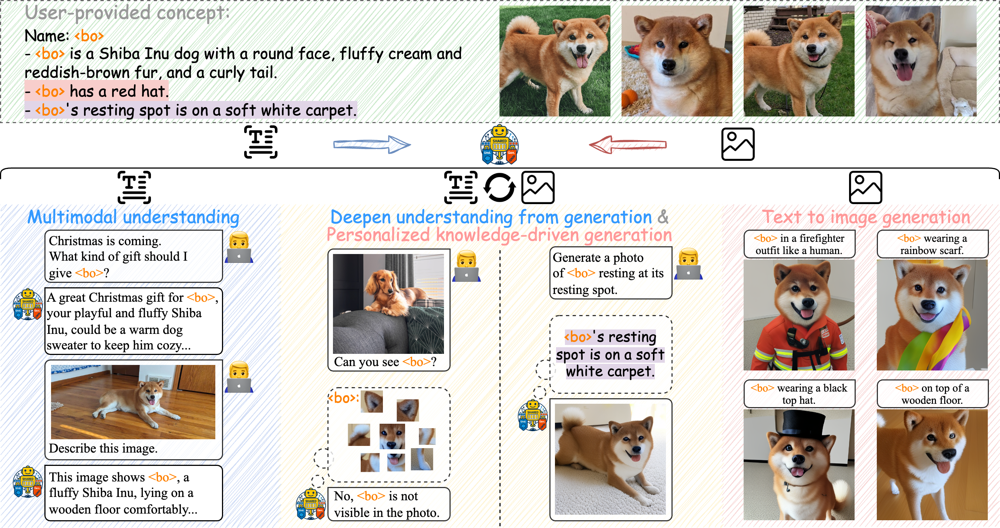

<!-- <div align="center">
<h1>
✨ UniCTokens: Boosting Personalized Understanding and Generation via Unified Concept Tokens ✨
</h1>
</div> -->
<div align="center">
<h1>
✨ UniCTokens: Boosting Personalized Understanding and Generation via Unified Concept Tokens ✨
</h1>

<h3>—————— NeurIPS 2025 ——————</h3>
</div>


<div align="center">

[Ruichuan An](https://github.com/arctanxarc), [Sihan Yang](https://github.com/Hhankyangg)<sup>*</sup>, [Renrui Zhang]()<sup>†</sup>, [Zijun Shen](), [Ming Lu](), [Gaole Dai]() <br> [Hao Liang](), [Ziyu Guo](), [Shilin Yan](), [Yulin Luo](),
[Bocheng Zou](), [Chaoqun Yang](), [Wentao Zhang]()<sup>‡</sup>

<sup>*</sup> Equal Contribution &nbsp;&nbsp;&nbsp; <sup>†</sup> Project Leader &nbsp;&nbsp;&nbsp; <sup>‡</sup> Corresponding Author

</div>

<p align="center">
  <a href="https://arxiv.org/abs/2505.14671"><b>📄 Paper</b></a> |
  <a href="#-unictokens-dataset"><b>📦 Dataset</b></a> |
  <a href="#-quick-start-for-dataset"><b>🚀 Quick Start</b></a> |
  <a href="#️-training-a-concept"><b>⚙️ Training</b></a> <br>
  <a href="#-Evaluation"><b>📊 Evaluation</b></a> |
  <a href="#-license"><b>📜 License</b></a> |
  <a href="#-citation"><b>📝 Citation</b></a> |
  <a href="#-contact"><b>📬 Contact</b></a>
</p>

<p align="center">
     <br>
</p>

## 📰 Introduction

**UniCTokens** is an innovative framework that effectively integrates personalized information into a unified vision language model (VLM) for understanding and generation tasks. Existing methods typically treat understanding and generation tasks separately, which limits the model's ability to generate images with complex prompts. For example, given the concept $\langle bo \rangle$, generating "$\langle bo \rangle$ wearing its hat" without additional descriptions of what the hat looks like. We call this **personalized knowledge-driven generation**.

UniCTokens addresses this limitation through a three-stage progressive training strategy:
1. Understanding warm-up.
2. Bootstrapping generation from understanding.
3. Deepening understanding from generation(Generation as Perception).

Our research demonstrates that enhanced understanding improves generation, and the generation process can yield valuable insights into understanding.

## 🔥 Key Features

- 🔄 **Unified Concept Tokens**: Unifying personalizaed understanding and generation tasks in a single model.
- 🧠 **Personalized Knowledge-Driven Generation**: Leveraging external personalized knowledge for complex image generation.
- 📈 **Mutual Enhancement**: Three-stage strategy promoting mutual enhancement of understanding and generation, achieving cross-task information transfer.
- 📊 **UnifyBench**: The first benchmark for assessing personalized understanding, generation, and personalized knowledge-driven generation all in one.

## 📊 UnifyBench Benchmark Tasks

### Multi-Modal Understanding (MMU)

| Sub-task | Source files | Evaluation focus |
| :-: | :-: | :-: |
| **Text-Only QA** | `test/<concept>/text_only.json`   | Check whether the model remembers concept knowledge (no image) |
| **VQA**          | `test/<concept>/vqa.json` + image | Visual question answering about the concept image                |
| **Rec**          | `test/*.png`            | Pure visual recognition capability                               |

### Text-to-Image Generation (T2I)

| Mode | Input | Metrics |
| :-: | :-: | :-: |
| **Vanilla generation**            | Prompts from the DreamBooth Dataset → target-concept images | CLIP-I / CLIP-T · ArcFace similarity                              |
| **Personalized knowledge-driven** | `t2i_conditions.json`                                           | Combined T2I-Score: must satisfy both visual & textual attributes |

## 📦 UniCTokens Dataset

> [Download the dataset here](https://drive.google.com/file/d/1bRv_E855P2ds6_1YeyQtJ7kfUxntPoGa/view?usp=sharing)

### Data Overview

| Item | Description |
| :-: | :-: |
| **Total concepts**     | 20 (Human × 10 · Animal × 5 · Object × 5)                                              |
| **Images per concept** | **N ≈ 10 – 15** (already split into *train* / *test*)                                  |
| **Negative samples**   | `random_images/` (100 random irrelevant images) + `negative_example/` (hard negatives) |

### Directory Structure

```text
UniCTokens/
├── black_512x512.png          # Pure black placeholder
├── concepts_list.json         # List of 20 concept names
├── template.json              # Template for generating training data
├── random_images/             # 100 simple negative samples for training
│   ├── 0.png
│   └── … 99.png
├── concept/                   # 🔑 Concept data (train / test)
│   ├── train/
│   │   └── <concept_name>/    # 20 folders
│   │       ├── 0.png … N.png          # Original training images
│   │       ├── cropped/               # Cropped regions
│   │       ├── info.json              # Concept profile & extra info
│   │       ├── conversations.json     # Training dialogues
│   │       ├── positive_recognitions.json  # Positive QA pairs
│   │       ├── random_recognitions.json    # Negative QA pairs
│   │       └── negative_example/      # Hard negatives + score.json
│   └── test/
│       └── <concept_name>/
│           ├── 0.png … 4.png
│           ├── text_only.json         # Text-only QA
│           ├── vqa.json               # VQA pairs
│           └── t2i_conditions.json    # Conditions for knowledge-driven T2I
├── gen_showo_training_data.py   # Script to create Stage-1/2/3 training files
├── gen_test_data.py             # Script to create all evaluation files
└── README.md
```

### 🚀 Quick Start For Dataset

1. **Set the dataset root**
   Open `gen_showo_training_data.py` and `gen_test_data.py` in the dataset root, change

   ```python
   DATA_ROOT = "/path/to/UniCTokens_Dataset"
   ```

   to the actual dataset path.

2. **Generate data**

   ```bash
   # Create Stage-1/2/3 training samples
   python gen_showo_training_data.py

   # Create MMU & T2I evaluation samples
   python gen_test_data.py
   ```

## ⚙️ Training a Concept

First, install dependencies:

```shell 
pip install -r requirements.txt
```

Our training is conducted per concept, and we provide a Three-Stage Training Framework script that allows training for any given concept:

```shell  
concept="bo"  

# Stage 1: Understanding warm-up
python train_w_3_stages/train_p_stage_1.py --concept "${concept}" --data_root <path/to/uni_c_tokens_data> --task_name test_train_s1 --need_new_tokens --mmu_data --init_by_images --need_init  

# Stage 2: Bootstrapping generation from understanding
python train_w_3_stages/train_p_stage_2.py --concept "${concept}" --data_root <path/to/uni_c_tokens_data> --task_name test_train_s2 --pre_trained_ckpt_name test_train_s1 --t2i_data --mmu_data  

# Transition from Stage 2 to Stage 3
python train_w_3_stages/stage_2_to_3_v1.py --concept "${concept}" --ckpt_name test_train_s2  

# Stage 3: Deepening understanding from generation
python train_w_3_stages/train_p_stage_3.py --concept "${concept}" --data_root <path/to/uni_c_tokens_data> --task_name test_train_s3 --pre_trained_ckpt_name test_train_s2 --t2i_data --mmu_data  
```

## 📊 Evaluation

Our evaluation procedure follows the same concept-based setup as training, where each concept is evaluated individually. We provide scripts to evaluate any given concept across various metrics:

1. **Personalized Understanding** Evaluation Script

First, set your DeepSeek API key in `eval/eval_p_mmu.py`:

```python
CLIENT = init_deepseek("your api key")
```

Then run the evaluation:

```shell
python eval/eval_p_mmu.py --data_root <path/to/uni_c_tokens_data> --concept <concept_to_eval> --ckpt_name test_train_s3 --epoch_to_load 20
```

2. **Personalized Generation - Pure Generation** Evaluation Script


For Pure Generation, we use the test prompts from the DreamBooth dataset to compute CLIP-I and CLIP-T scores. First, generate the images to be evaluated:

```shell
python eval/gen_p_images_for_gen_eval.py --data_root <path/to/uni_c_tokens_data> --concept <concept_to_eval> --ckpt_name test_train_s3 --epoch_to_load 20 --inverse_prompt
```

After generating the images, modify the parameters as needed in `eval/clip_eval.py` and run `eval/clip_eval.py` to complete the evaluation.

3. **Personalized Generation — People Generation & Knowledge-driven Generation** Evaluation Scripts

For People Generation and Knowledge-driven Generation, first generate the images to be evaluated:

```shell
python eval/gen_p_images_for_mmu_t2i.py --data_root <path/to/uni_c_tokens_data> --concept <concept_to_eval> --ckpt_name test_train_s3 --epoch_to_load 20 --inverse_prompt
```

- **People Generation**: Modify the parameters in `eval/face_eval_v2.py`, then run `eval/face_eval_v2.py` to evaluate face generation.
- **Knowledge-driven Generation**: First set your GPT API key in `eval/api.py`, then modify the parameters in `eval/4o_judge_t2i.py` and run it to complete the evaluation.

## 📜 License

The dataset and code are released under **CC-BY-NC 4.0** and are intended for academic research **only**. Commercial use is not permitted.

## 📝 Citation

If you use UniCTokens in your research, please cite our paper:

```bibtex
@article{an2025unictokens,
  title={UniCTokens: Boosting Personalized Understanding and Generation via Unified Concept Tokens},
  author={An, Ruichuan and Yang, Sihan and Zhang, Renrui and Shen, Zijun and Lu, Ming and Dai, Gaole and Liang, Hao and Guo, Ziyu and Yan, Shilin and Luo, Yulin and others},
  journal={arXiv preprint arXiv:2505.14671},
  year={2025}
}
```

## 📬 Contact

* GitHub Issues: [https://github.com/arctanxarc/UniCTokens/issues](https://github.com/arctanxarc/UniCTokens/issues)
* Email: [arctanxarc@gmail.com](mailto:arctanxarc@gmail.com)
